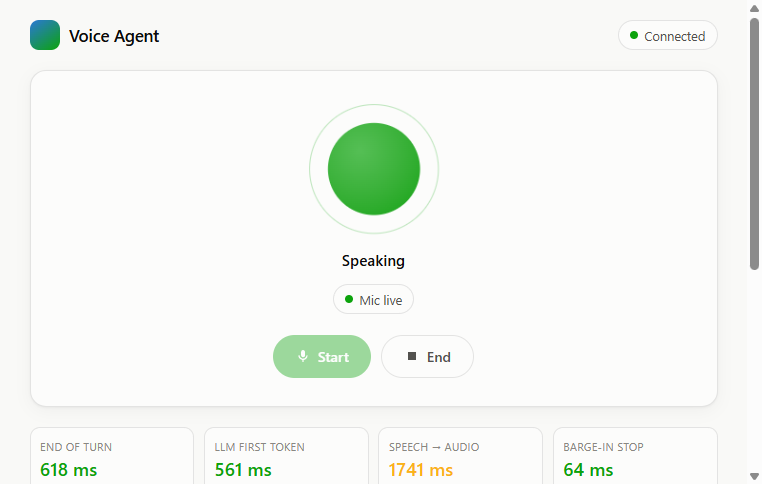
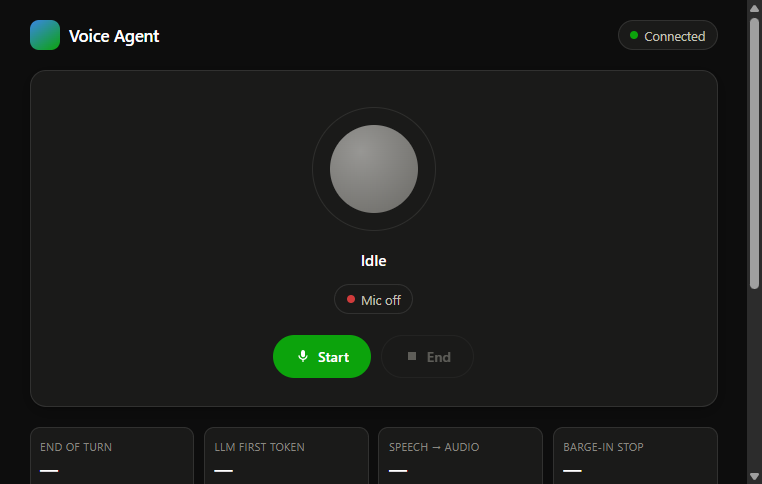

# Realtime Voice Agent

[](https://github.com/arafaymalik7/realtime-voice-agent/actions/workflows/ci.yml)
[](LICENSE)
[](tsconfig.json)
[](https://nodejs.org)

A browser-based real-time voice AI agent: speak into your mic, the agent listens, thinks, and talks back — interruptible mid-sentence, with sub-second turn detection.

> **Barge-in stops the agent in 64 ms. End-of-speech to first agent audio: ~1.5 s.** Every number in this README comes from a real measured run, logged by the built-in instrumentation.

A clean, animated single-page UI shows the conversation as chat bubbles, a state orb (listening / thinking / speaking), live latency stat tiles, and tool-call activity — see [Screenshots](#ui) below.

The core of this project is the **turn-taking loop**: streaming audio in, detecting when the human stops speaking, responding fast enough to feel alive, and stopping instantly when the human talks over the agent (barge-in).

## Architecture

```
Browser                         Node server (orchestrator)              External APIs
┌───────────────┐   binary     ┌──────────────────────────┐
│ mic capture   │──audio──────▶│ WS handler                │
│ (AudioWorklet)│              │  ├─ session state machine │──▶ Deepgram Flux (STT stream)
│  + energy VAD │              │  ├─ turn detector         │◀── transcripts + turn events
│ audio player  │◀─binary─────│  ├─ LLM caller (stream)   │──▶ Gemini (stream)
│ (instant-stop │   audio      │  └─ TTS streamer          │──▶ ElevenLabs (TTS stream)
│  barge-in)    │              └──────────────────────────┘
└───────────────┘
```

| Module                                                   | Responsibility                                                                  |
| -------------------------------------------------------- | ------------------------------------------------------------------------------- |
| [`src/server/stt.ts`](src/server/stt.ts)                 | Audio frames in → transcript + turn events out (Deepgram Flux, `v2/listen`)     |
| [`src/server/turn.ts`](src/server/turn.ts)               | Turn state machine: `LISTENING → THINKING → SPEAKING`, eager replies, barge-in  |
| [`src/server/llm.ts`](src/server/llm.ts)                 | Transcript + history in → streamed tokens out (Gemini, abortable mid-stream)    |
| [`src/server/tts.ts`](src/server/tts.ts)                 | Text in → 16 kHz PCM out (ElevenLabs Flash over WebSocket, swappable interface) |
| [`src/server/index.ts`](src/server/index.ts)             | HTTP/WS server, wiring, validation                                              |
| [`public/worklet/capture.js`](public/worklet/capture.js) | Mic capture, 48→16 kHz resampling, voice-activity detection                     |

## Latency engineering

Measured on a free-tier stack (all numbers from real runs, logged by the built-in instrumentation):

| Metric                                    | Measured                        | Notes                                                  |
| ----------------------------------------- | ------------------------------- | ------------------------------------------------------ |
| Barge-in: user speaks → agent audio stops | **64 ms** (8/8 runs)            | Client-side energy VAD; no network round trip          |
| End-of-turn detection (human voice)       | ~480–650 ms                     | Deepgram Flux model-integrated turn detection          |
| LLM first token                           | ~550 ms median                  | `gemini-3.1-flash-lite`; free-tier jitter up to ~1.3 s |
| End of user speech → first agent audio    | ~1.5–2 s typical (best 1369 ms) | Bounded by free-tier LLM jitter                        |
| Under load (3 concurrent sessions)        | 1369 / 1735 / 2071 ms           | All replies correct                                    |

Key techniques:

- **Eager end-of-turn overlap** — the LLM + TTS pipeline starts on Deepgram's `EagerEndOfTurn` (moderate confidence); audio is buffered server-side and flushed the instant `EndOfTurn` confirms — or discarded if the user keeps talking (`TurnResumed`). Unconfirmed audio never plays.
- **Client-side barge-in** — an RMS VAD inside the AudioWorklet detects overlapping speech in ~64 ms and kills playback locally, then tells the server to abort the TTS and LLM streams. A gate drops stale in-flight audio chunks (WebSocket ordering makes this race-free). Deepgram `StartOfTurn` acts as a server-side fallback.
- **Connection pre-warming** — the Deepgram socket and the LLM HTTPS connection are established when the browser connects, before anyone speaks.
- **Raw PCM end to end** — no codec latency; playback is scheduled gaplessly via Web Audio and can be stopped instantly.

## Setup

```bash
npm install
cp .env.example .env   # fill in your keys
npm run dev            # build + start, then open http://localhost:3000
```

Required keys (all have free tiers):

| Env var              | Provider                                                                                         |
| -------------------- | ------------------------------------------------------------------------------------------------ |
| `DEEPGRAM_API_KEY`   | [Deepgram](https://console.deepgram.com/) — streaming STT (Flux)                                 |
| `GEMINI_API_KEY`     | [Google AI Studio](https://aistudio.google.com/apikey) — LLM                                     |
| `ELEVENLABS_API_KEY` | [ElevenLabs](https://elevenlabs.io/) — streaming TTS (key needs the _Text to Speech_ permission) |

Optional: `TTS_VOICE_ID` (defaults to a premade voice), `PORT` (default 3000).

## UI

<p align="center">
  
  
</p>

Vanilla HTML/CSS/TS, no framework. A validated status-color system (fixed
good/warning/serious/critical hues, never re-themed) drives the state orb and
stat-tile coloring; light/dark theme follows the OS. The state orb pulses
through Listening → Thinking → Speaking, the transcript renders as chat bubbles,
tool calls appear inline, and the four latency stat tiles color themselves
green/amber/red against thresholds. Files: [`public/index.html`](public/index.html), [`public/styles.css`](public/styles.css).

> A short screen recording of a live call is worth more than a static shot —
> a demo GIF is on the roadmap ([#roadmap](#roadmap)).

## Roadmap

This started as a technical demo of the hard part (turn-taking, barge-in, safe
failure). It is evolving into a product: **an AI voice receptionist for local
businesses** — a phone number (and web widget) that answers every call, books
into a real calendar, answers FAQs, and hands off to a human when needed.

| Milestone | Focus |
|---|---|
| **Public demo** | Dockerized deploy on HTTPS · Groq LLM for consistent latency · real calendar booking |
| **Phone channel** | Twilio Media Streams → the existing PCM pipeline; a real number rings the agent |
| **Multi-tenant** | Postgres + Redis; per-business config (persona, voice, hours, tools) — no code edits |
| **Dashboard** | Auth · agent config UI · call history + transcripts + outcomes · analytics · Stripe billing |
| **Trust** | Consent + recording, retention policy, encryption at rest, audit logs, knowledge-base FAQ |
| **Quality** | Unit + integration + E2E tests, agent evals, OpenTelemetry tracing, Sentry |

Contributions and ideas welcome — see [CONTRIBUTING.md](CONTRIBUTING.md).

## Known limitations

- **LLM headline jitter**: the free Gemini tier's first-token latency varies
  (~550 ms median, up to ~1.3 s) — the documented reason the 1500 ms headline
  target is hit in best case but not at median. Swapping `llm.ts` to Groq's
  free tier is the known fix (not applied — this stack is intentionally kept
  on 100%-free-tier providers).
- **TTS concurrency ceiling under rapid-fire interruption**: the eager-reply
  design opens a new ElevenLabs stream on every incremental transcript update;
  a real conversation's pacing stays well under ElevenLabs' free-tier
  concurrent-stream cap, but a synthetic stress test with interruptions every
  few seconds can exhaust it, surfacing as `tts: TIMEOUT`. Safe failure (Phase 7)
  handles this correctly — spoken fallback, structured log, clean session end,
  and no further work leaks through after the session ends (verified fix).

## Security

- API keys live server-side only — never sent to the browser, never logged, never committed (`.env` is gitignored; history verified clean; built client bundle grepped for key patterns: zero hits).
- WebSocket hardening: Origin allowlist, **short-lived single-use session tokens** (`GET /session`, 60 s TTL), max 3 concurrent connections per IP, 1 MiB inbound message cap, unknown message types rejected, 5-minute idle timeout.
- **No PII in logs by default** — transcripts/replies/tool args are redacted unless `DEBUG_TRANSCRIPTS=1`. Audio is never logged.
- Per-session LLM rate limit (60 calls/min) caps cost abuse.
- Safe failure: every provider call has a timeout and retry cap; on unrecoverable failure the user hears a pre-cached spoken fallback line (or a tone if TTS itself is down) and the session ends cleanly — never a silent hang.
- Least-privilege tools: each tool does one job; no shell, no arbitrary URLs.
- Static file serving with path-traversal protection.

## Development log

Built in phases, each ending with a hard, measured check ([CLAUDE.md](CLAUDE.md) is the project spec):

| Phase | Delivered                                                | Check result                                                         |
| ----- | -------------------------------------------------------- | -------------------------------------------------------------------- |
| 0     | Skeleton: TS build, WS server, health endpoint           | Build + audit clean, WS connects                                     |
| 1     | Audio uplink: AudioWorklet capture, 16 kHz PCM streaming | 90 frames / 5 s, all 1600 B                                          |
| 2     | STT + endpointing: Deepgram Flux, turn events            | 100% word accuracy; EoT gap 563–705 ms                               |
| 3     | LLM: Gemini streaming, abortable, history                | "Four." correct; first token 552 ms median                           |
| 4     | Full voice loop: ElevenLabs TTS, eager overlap           | Headline 1555 ms best (free-tier bound)                              |
| 5     | **Barge-in + turn state machine**                        | 8/8 stops at 64 ms, zero resumes                                     |
| 6     | Tools mid-conversation (booking demo)                    | Correct tool + args, confirmation id spoken, recalled next turn      |
| 7     | Safe failure: timeouts, fallbacks                        | All 3 providers killed → spoken fallback, structured log, clean end  |
| 8     | Security + latency hardening                             | Full checklist pass; 0 audit vulns; 0 secrets in bundle; load-tested |

## License

[MIT](LICENSE)
